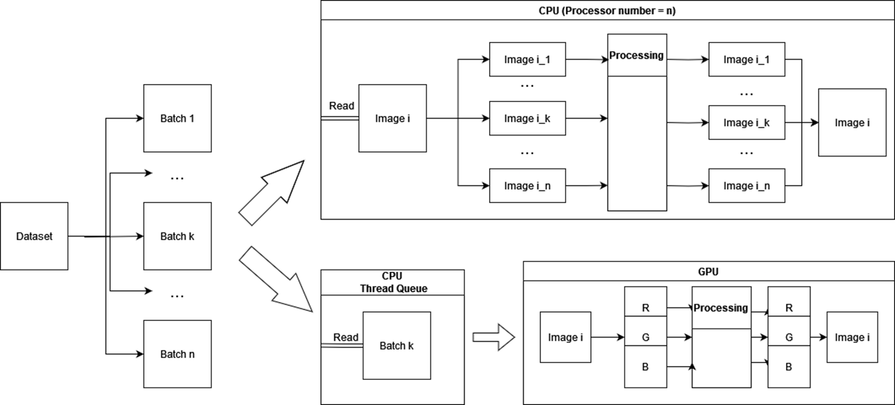

# General strategy

To complete this task, we chose two different approaches: using CPU and using GPU.
- Overall: the dataset gets divided into batches, size of which is chosen in the code itself.
- CPU: The CPU gets an image, divides it into horizontal strips (number of strips matches the number of cores used). Each strip is processed in parallel. After the processing is finished, the strips are merged. This process continues until all of the data has been processed.
- GPU: The batch is added into a Thread Queue on the CPU. It is then passed on to the GPU, where the image is divided into RGB values. Theses values are processed in parallel. After the processing is finished, the image gets merged. This process continues until all of the data has been processed.

# 1st Team Assignment: Image Processing with Parallel Computing

## Overview

This project, running from March 6th, 2024 to March 25th, 2024, aims to apply various image processing techniques using parallel computing. The objective is to perform operations such as converting images to black and white, blurring, and adding noise on a dataset of images, leveraging parallel processing to optimize performance.

## Timeline

- **Start Date:** March 6th, 2024
- **End Date:** March 25th, 2024, 21:00
- **Presentations:** March 26th, 2024, 16:00

## Dataset

The images for processing are provided in the following dataset: [Download Dataset](https://www.dropbox.com/s/1eb7fx9bqr85cfo/data_set_VU_test1.zip?dl=1)

## Tasks

### 1. Parallel Splitting of the Task

- **Objective:** Strategize the division of image processing into parallelizable sub-tasks.
- **Guidance:** Focus on concepts of parallel computing and workload balancing.

### 2. Implementation of Parallel Processing

- **Objective:** Implement parallel processing for image transformations.
- **Guidance:** Utilize Python parallel programming libraries.

###  ~~3. Image Processing Techniques~~ 

- ~~**A. Black and White Conversion:**~~ Optimize threshold to achieve a balanced black and white image.
- ~~**B. Image Blurring:**~~ Apply a blurring effect.
- ~~**C. Noise Addition:**~~ Add noise equivalent to 10% of the black pixels in the converted black and white images.
- **Guidance:** Explore various techniques and algorithms for each processing requirement.

### 4. Testing Parallel Job Efficiency

- **Objective:** Assess the efficiency of parallel processing across different image processing tasks.
- **Guidance:** Methodologies for measuring and comparing performance.

### 5. Presentation of the Solution

- **Objective:** Present the comprehensive solution to the project tasks.
- **Guidance:** Ensure the presentation is understandable and concise, suitable for a technical audience.

## Submission and Presentation Details

- **Deadline:** All tasks must be completed and submitted by the end date.
- **Presentation Format:** A maximum of 5 slides covering the solutions.
- **Selection for Presentation:** Presenters will be chosen randomly from each group.
- **Submission Requirement:** Code must be submitted to a specified repository (GitHub, GitLab).

## Evaluation Criteria

- **Code Quality:** Clear and efficient implementation of image processing techniques.
- **Technique Implementation:** Effectiveness in applying the specified image transformations.
- **Performance Analysis:** Comprehensive evaluation of parallel processing efficiency.
- **Presentation Skills:** Clarity and conciseness in presenting complex solutions.

## Additional Recommendations

- **Resources:** Refer to materials on image processing and parallel computing.
- **Milestones:** Establish intermediate goals to ensure progress.
- **Collaboration:** Work as a team, especially in distributing tasks related to different image processing techniques.
